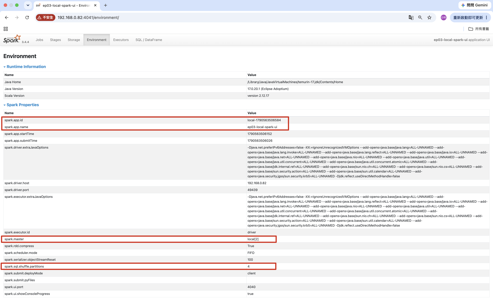
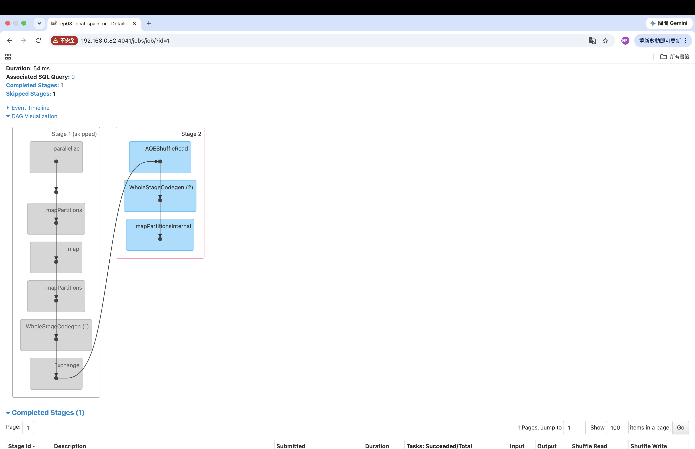
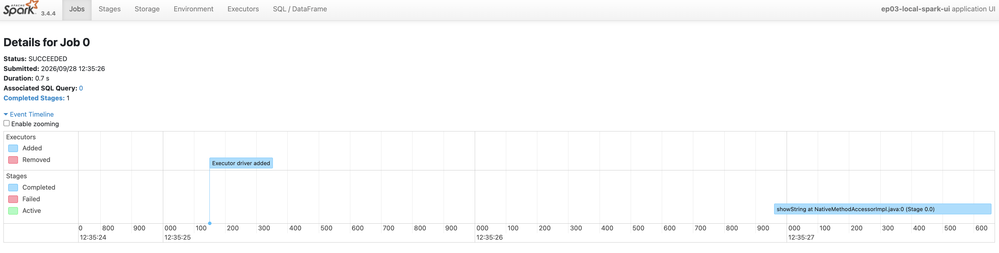
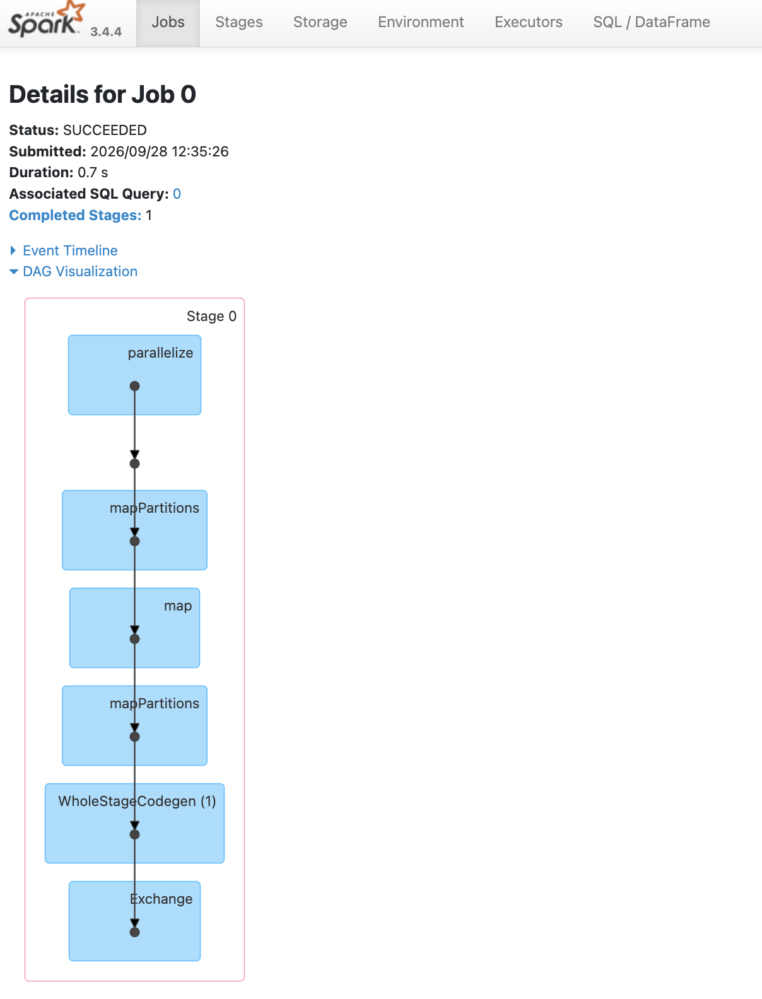
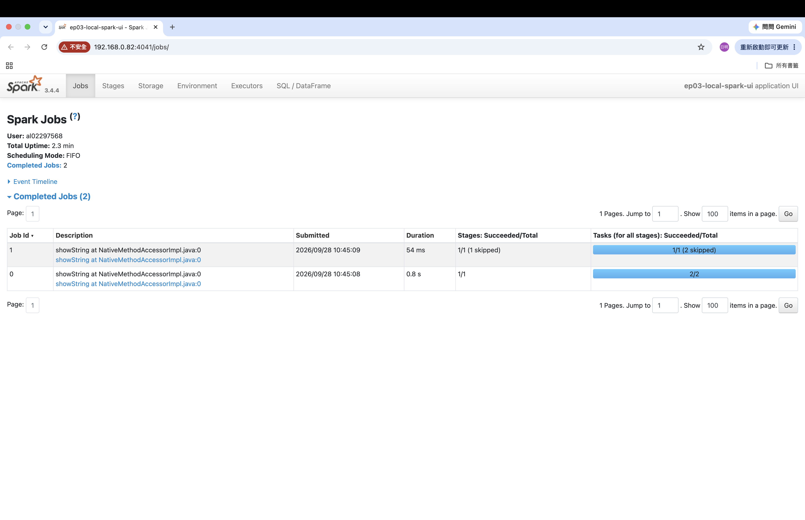

# Ep03｜第一次打開 Spark UI：單機 Spark 也看得到 DAG、Stage 與 Task

上一集，我知道 action 出現後，Spark 才會開始規劃並執行工作。不過「切成 stage」、「分配 task」還是有點抽象；我想親眼看看它們到底長什麼樣子。

這次我沒有連 YARN、也沒有建立叢集，只是在筆電上跑一個 local mode 的 Spark application，然後打開 Spark UI。

## 讀完這篇後你會更了解......

- 如何在 local mode 找到 Spark UI，並用 Environment 頁面確認 application 的實際設定。
- Spark application、Job、Stage、Task 之間的層級，以及一次 `show()` 為什麼可能留下不只一個 Job。
- Job 詳情中的 Event Timeline、DAG Visualization、Completed Stages 能提供什麼資訊，以及如何作為效能排查的入口。

## 先從整體看：Spark UI 在回答什麼？

Spark UI 是一個隨 Spark application 啟動的本機網頁介面。執行程式後，Spark 會印出 UI URL；在程式結束前打開它，就可以觀察這次 application 的設定、執行紀錄與資源使用情況。

我先把 UI 裡最常用的執行層級整理成這張圖：

```text
Spark application
  └─ Job：一次 action 所要求的工作
       └─ Stage：可連續執行的一段工作
            └─ Task：一個 partition 對應的一個工作單位
```

這個結構在 local mode 依然存在。差別只在於 task 不會被送到遠端 executor，而是在本機 JVM 的 thread 上執行。

如果程式只有 transformation，Spark UI 仍會存在，Environment、Executors 等頁面也看得到 application；但不會出現 Job、Stage 或 Task。這正好呼應了上一集介紹的 lazy execution：**DataFrame 可以先累積計畫，但 action 出現前還沒有真正的資料處理工作。**

## 一個會留下 shuffle 痕跡的小實驗

這次我讓訂單資料先過濾，再依地區彙總：

```python
regional_revenue = (
    transactions.where(C("amount") >= 100)
    .groupBy("region")
    .agg(
        F.count("order_id").alias("order_count"),
        F.sum("amount").alias("total_amount"),
    )
)

regional_revenue.show()
```

`where()`、`groupBy()` 與 `agg()` 都是 transformation；最後的 `show()` 才是 action。因為 `groupBy("region")` 需要把相同 region 的資料聚在一起，這個小實驗刻意產生了 shuffle，讓 Stage 邊界能在 UI 裡被看見。

在 Environment 頁面，我先確認幾個程式設定真的生效：

| Spark property | 這次看到的值 | 用途 |
| --- | --- | --- |
| `spark.app.name` | `ep03-local-spark-ui` | 方便在人與 UI 中辨識 application。 |
| `spark.app.id` | `local-...` | 這一次具體執行的識別碼。 |
| `spark.master` | `local[2]` | 使用本機模式，最多兩個 task thread 可同時執行。 |
| `spark.sql.shuffle.partitions` | `4` | shuffle 後規劃使用的 partition 數。 |



## 一次 `show()`，為什麼有兩個 Job？

我原本只呼叫了一次 `show()`，但 Jobs 頁面出現 Job 0 與 Job 1。這提醒我：**一次 action 通常會提出一次執行需求，但不保證 UI 上只會有一個 Job。**

這次的流程可以簡化成：

```text
Job 0
  └─ Stage 0：處理來源資料、寫出 shuffle data
       └─ 2 個 task，Shuffle Write 377 B

Job 1
  ├─ Stage 1：skipped，不重跑已完成的前段結果
  └─ Stage 2：透過 AQEShuffleRead 讀取 shuffle data，完成後續計算
```

Job 0 的 Stage 0 有兩個 task，代表這次來源資料有兩個 partition。`local[2]` 則讓這兩個 task 最多能在兩個本機 thread 上同時執行；它不是 task 數量固定為二的原因。

Job 1 裡的 `skipped` 也不是失敗。前一段 shuffle 結果已經存在，Spark 不必重新讀取、過濾與寫出資料，而是直接重用它。`AQEShuffleRead` 中的 AQE 是 Adaptive Query Execution；此刻我先把它理解成 Spark 會參考實際 shuffle 結果，調整後續執行。AQE 的細節之後再深入。



*Job 1 中灰色的 skipped Stage 不會重跑；Stage 2 則透過 `AQEShuffleRead` 接續前段 shuffle 結果。*

> ***看到 `Exchange`、Shuffle Write、AQEShuffleRead 與 skipped stage，可以把它們連成同一個故事：前一段先重新分配並寫出資料，下一段再讀取、重用並完成運算。***

## Job 詳情頁：三個區塊各自在說什麼？

點進一個 Job 後，最值得先看的有三個區塊。

### Event Timeline：工作花時間在哪裡？

Event Timeline 用時間軸顯示 executor 的增減與各 Stage 的開始、結束時間。這次資料很小，只有一條短短的 Stage；但在真正的慢 job 中，它能幫我先定位哪個 stage 特別久、是否反覆重試，或 executor 是否在中途離開。



### DAG Visualization：資料如何流動、在哪裡被切開？

DAG Visualization 讓我看見 transformation 串成的資料流，以及 Stage 的邊界。我的圖中，`parallelize`、`mapPartitions`、`map`、`WholeStageCodegen` 都還在同一個 Stage 裡；到了 `Exchange`，資料必須重新分配，才會形成 shuffle 邊界。



圖中的方塊不會精準對應某一行 Python API，但它們是很有用的效能線索：

| UI 裡常見的方塊 | 大致對應的操作或意義 | Debug 時可以問什麼？ |
| --- | --- | --- |
| `Filter` / `Project` | `where()`、`select()`、`withColumn()` | 條件是否能提早過濾？是否計算了最後沒用到的欄位？ |
| `HashAggregate` | `groupBy().agg()` | 聚合前資料量是否太大？key 是否有 skew？ |
| `Exchange` | `groupBy()`、`join()`、`orderBy()`、`repartition()` 等可能造成 shuffle 的操作 | 為什麼需要重新分配？Shuffle Read／Write 是否過大？ |
| `SortMergeJoin` / `BroadcastExchange` | 大型 join / broadcast join | 是不是選到合適的 join 策略？ |
| `BatchEvalPython` | Python UDF | 能否改用 Spark built-in function，避免 JVM 與 Python worker 往返？ |
| `WholeStageCodegen` | Spark 將多個 JVM operators 合併成一段執行 | 它不是單一 API；通常代表 Spark 能連續處理一串 JVM 操作。 |

我不需要背下所有方塊名稱，但可以開始建立「方塊 → 資料操作 → 可能成本」的直覺。

### Completed Stages：實際跑了多少 task、讀寫了多少資料？

Completed Stages 是把執行結果濃縮成表格。這次 Stage 0 的 `Tasks: 2/2` 表示兩個 task 都成功完成；`Shuffle Write: 377 B` 則是最直接的證據，說明它把中間結果寫給後續 Stage 使用。



未來看到 job 變慢時，我可以沿著這條路往下找：

```text
哪個 Job 慢？
  ↓
哪個 Stage 慢？
  ↓
task 數、task 耗時、Shuffle Read／Write 是否異常？
  ↓
DAG 裡有沒有 Exchange、Join、Sort 或 Python UDF？
  ↓
回到對應的 DataFrame 操作與資料特性檢查
```

這還不是完整的效能調校方法，但已經讓我不再只看到「Spark job 很慢」，而能開始提出更具體的問題。

## 這次我真的看見了什麼？

這次我沒有建立 cluster，卻已經在筆電上看到 Spark 重要的執行結構：一個 application 裡的 action 如何留下 Job、Job 如何拆成 Stage、Stage 又如何由多個 task 處理不同 partition。

更重要的是，Spark UI 不是只在 job 失敗時才打開的除錯工具。它可以連回我平常寫的 DataFrame 操作、Catalyst 選出的 physical plan，以及資料在 shuffle、聚合或 join 時真正付出的成本。

下一篇，我想把 UI 裡看到的概念畫回 local mode 的地圖：資料在哪裡、Driver 在哪裡、程式又到底在哪裡執行？

---
## 完整程式碼與參考資料

🚀 GitHub：\
[Ep03｜第一次打開 Spark UI：單機 Spark 也看得到 DAG、Stage 與 Task](https://github.com/jeffery5bai/spark-learning-lab/tree/main/episodes/ep03-local-spark-ui)

🚀 spark-learning-lab 系列文章與實作：\
[https://github.com/jeffery5bai/spark-learning-lab](https://github.com/jeffery5bai/spark-learning-lab)

Apache Spark 3.4.4 — Web UI：\
[https://archive.apache.org/dist/spark/docs/3.4.4/web-ui.html](https://archive.apache.org/dist/spark/docs/3.4.4/web-ui.html)

Apache Spark 3.4.4 — Job Scheduling：\
[https://archive.apache.org/dist/spark/docs/3.4.4/job-scheduling.html](https://archive.apache.org/dist/spark/docs/3.4.4/job-scheduling.html)
