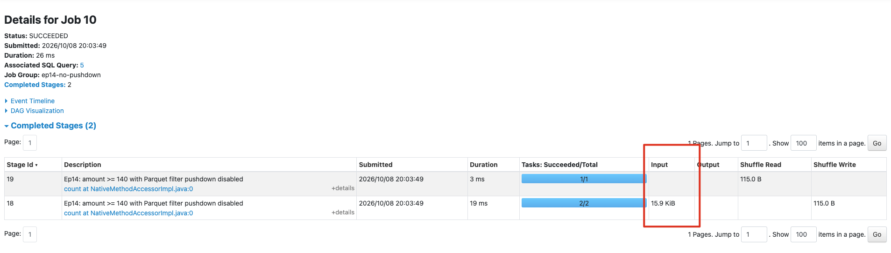
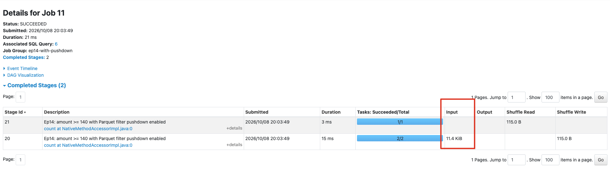

# Ep14｜同一份表，Spark 為什麼能少讀那麼多資料？從 Parquet 結構看 column pruning、predicate pushdown 與 partition pruning

上一集看完 Parquet 的 row group、column chunk 與 footer 後，我想接著深入了解一個更實際的問題：當我只查兩個欄位、只要某一天、只要 `amount >= 140` 的資料時，Spark 到底在哪一層停止讀取不需要的資料？

答案來自數個相互銜接的設計。Spark 會讓 query 的欄位與條件一路往下傳：先排除不需要的 partition directories，再決定 Parquet file 中需要哪些 columns，並將可用的 filter 交給 reader。Parquet 的 columnar layout 與 footer statistics 則讓 reader 有機會少讀資料內容。

> *Spark 能少讀多少，取決於 query、table layout、Parquet metadata 與 reader 能力共同配合；先分清楚減少的是 columns、files，還是 file 內的資料區塊。*

## 讀完這篇後你會更了解……

- `ReadSchema`、`PartitionFilters`、`PushedFilters` 分別在說什麼。
- column pruning、partition pruning、predicate pushdown 與 file／row-group skipping 的差異。
- 哪些機制由 Parquet 檔案結構支援，哪些依靠 table 的目錄布局。
- 如何用 `explain()` 與 Spark UI 以證據檢查「少讀資料」。
- 為什麼 `PushedFilters` 出現，不等於保證完全不會碰到不符合的檔案。

## 先畫出讀取路徑：一個 query 會縮小哪些範圍？

這次使用一個 Hive-style partitioned Parquet dataset。它有三個日期目錄；每個日期各寫出一個 Parquet file，且 `amount` 範圍故意不重疊：

```text
events/
├── event_date=2026-10-01/part-....parquet   amount: 0.0–49.0
├── event_date=2026-10-02/part-....parquet   amount: 50.0–99.0
└── event_date=2026-10-03/part-....parquet   amount: 100.0–149.0
```

例如這個 query：

```python
(
    events_from_files
    .filter(C("event_date") == "2026-10-03")
    .filter(C("amount") >= 140)
    .select("region")
)
```

可以依序縮小讀取範圍：

```text
DataFrame / SQL
  ↓ select region
Parquet column chunks
  ↓ WHERE event_date = '2026-10-03'
table partition directory: event_date=2026-10-03/
  ↓ WHERE amount >= 140
Parquet file / row group statistics
  ↓
matching values from the required columns
```

這張圖用來定位每種訊息能排除哪一層資料；實際執行順序由資料來源實作決定。

## 實驗設定：三個可辨識的分區

實驗先建立 3,000 筆 events，依 `event_date` 寫成三個 partition directories。為了讓觀察穩定，先以 `repartition(3, "event_date")` 讓這份小資料恰好每個日期寫出一個檔案：

```python
(
    events.repartition(3, "event_date")
    .write.mode("overwrite")
    .partitionBy("event_date")
    .parquet(str(events_path))
)
```

輸出確認每個日期都有 1,000 rows，並有不同的 `amount` 範圍：

```text
+----------+----+----------+----------+
|event_date|rows|min_amount|max_amount|
+----------+----+----------+----------+
|2026-10-01|1000|       0.0|      49.0|
|2026-10-02|1000|      50.0|      99.0|
|2026-10-03|1000|     100.0|     149.0|
+----------+----+----------+----------+
```

`event_date=...` 是 table 在 storage 上的目錄布局；`repartition(3, ...)` 則安排這次寫入的資料與 task。小資料剛好一個目錄一個 file，實務上的 `partitionBy` 並沒有這項保證。

## 第一個觀察：column pruning 只讀 query 需要的 Parquet columns

先從檔案重新讀取後，只選 `region`：

```python
events_from_files = spark.read.parquet(str(events_path))
region_only = events_from_files.select("region")
region_only.explain(mode="formatted")
```

Physical Plan 的 scan 顯示：

```text
Scan parquet
Output: [region, event_date]
ReadSchema: struct<region:string>
```

`ReadSchema` 是 Parquet reader 被要求讀取的 file schema。它只有 `region`，所以 `id`、`event_type`、`amount`、`description` 不需要從 Parquet data pages 解碼。`Output` 裡的 `event_date` 則由 `event_date=...` 路徑推得；scan 暫時保留它，最後的 `Project` 才只留下 `region`。

### 為什麼 Parquet 能支持 column pruning？

Parquet 邏輯上是一張 rows 組成的表，物理上卻把同一欄位連續存在一起：

```text
Parquet file
├── Row group 0
│   ├── region column chunk ── pages
│   ├── amount column chunk ── pages
│   └── description column chunk ── pages
├── Row group 1
│   └── ...
└── Footer
    ├── schema
    └── 每個 row group / column chunk 的位置
```

footer 告訴 reader `region` column chunk 在哪裡，因此讀取 `region` 時可以定位該欄位的 pages，而不必把同一批 rows 的其他 columns 一起解碼。若使用 row-oriented file format，同一筆 row 的欄位通常放在一起，選少數欄位就更難避開其餘內容。

## 第二個觀察：partition pruning 先從路徑排除不需要的 files

接著只查特定日期：

```python
one_date = (
    events_from_files
    .filter(C("event_date") == "2026-10-03")
    .select("region", "amount")
)
one_date.explain(mode="formatted")
```

scan plan 出現：

```text
PartitionFilters: [
  isnotnull(event_date),
  (event_date = 2026-10-03)
]
ReadSchema: struct<region:string,amount:double>
```

這次 Spark 在規劃 file scan 時就能保留 `event_date=2026-10-03/`，排除 10-01 與 10-02 的整個目錄。結果也只剩 1,000 rows，`amount` 範圍是 `100.0–149.0`。

### partition pruning 依靠 table layout

partition pruning 依靠的是資料夾名稱：

```text
WHERE event_date = '2026-10-03'
          ↓
events/event_date=2026-10-03/
```

Spark 不必打開 10-01、10-02 的 Parquet footer，就能根據路徑判斷它們不可能符合條件。這也是為什麼 `event_date` 適合作為常見時間範圍查詢的 partition column。

不過，只有 `amount >= 100` 並不能讓 Spark 從 directory name 推得只剩 10-03；`amount` 並不是這張表的 storage partition key。它是否能進一步少讀，要看 file metadata。

## 第三個觀察：predicate pushdown 將 `amount` 條件交給 Parquet reader

這次不篩 `event_date`，只查：

```python
high_amount = (
    events_from_files
    .filter(C("amount") >= 140)
    .select("region", "amount")
)
high_amount.explain(mode="formatted")
```

scan plan 顯示：

```text
PushedFilters: [IsNotNull(amount), GreaterThanOrEqual(amount,140.0)]
ReadSchema: struct<region:string,amount:double>
```

`PushedFilters` 表示 Spark 已將這個條件交給 Parquet reader。同時 plan 後方仍保留：

```text
Filter: isnotnull(amount) AND amount >= 140.0
```

data source 端的 filter 提供加速機會，Spark 仍保留自己的 `Filter` 確認最終結果符合 query。

### predicate pushdown 與 skipping 是兩個階段

predicate pushdown 的意思是「reader 收到條件」。條件幾乎每筆都符合時，例如 `amount >= 0`，自然沒有可跳過的內容。直接比較原始欄位與常數，也較容易讓資料來源使用統計：

```sql
-- 容易讓 reader 利用原始 amount 統計
WHERE amount >= 140

-- 函式或 UDF 可能讓 reader 難以使用原始欄位統計
WHERE custom_rule(amount) = true
```

是否可下推仍受 data source、Spark 版本與欄位型別影響，應以 `PushedFilters` 和實際 metrics 驗證。

## 第四個觀察：Parquet statistics 讓 file／row group 有機會被跳過

Parquet footer 會記錄 column chunk 的統計資訊，例如 `min`、`max`、`null count`。概念上，這份實驗的檔案可視為：

```text
amount >= 140

file for 2026-10-01: amount min=0,   max=49    → 不可能符合
file for 2026-10-02: amount min=50,  max=99    → 不可能符合
file for 2026-10-03: amount min=100, max=149   → 仍可能符合
```

統計常以 row group 為粒度；一個 file 有多個 row groups 時，reader 可只跳過其中不可能命中的 group。page index 能提供更細的判斷；Bloom filter 適合回答 `user_id = 123` 這類等值條件是否「一定不存在」。reader 仍須先讀 footer 或索引，才能決定哪些 data pages 值得讀取。

## 用 Spark UI 驗證：同一條件的 Input Size 真的變小了嗎？

單看 `PushedFilters` 無法證明實際 I/O 減少。因此實驗以相同的 `amount >= 140` 執行兩次 `count()`：先關閉 `spark.sql.parquet.filterPushdown`，再開啟它，並在 local Spark UI 比較 scan stage 的 `Input`。

關閉時，scan stage 讀取 `15.9 KiB`：



開啟後，scan stage 讀取 `11.4 KiB`：



| Parquet filter pushdown | matching rows | Scan stage Input |
| --- | ---: | ---: |
| disabled | 200 | 15.9 KiB |
| enabled | 200 | 11.4 KiB |

兩次都得到 200 rows，開啟 pushdown 的 scan 少讀約 4.5 KiB。`11.4 KiB` 也不等於只碰到一個資料檔：reader 可能仍須讀多個 files 的 footer 來判斷統計範圍。這個本機實驗證明此資料布局下 I/O 有下降；實際節省幅度仍受檔案大小、壓縮、row group 布局與 Spark 版本影響。

## 四種機制放在一起看

| 機制 | 主要依靠 | 直接減少的範圍 | 這次的證據 |
| --- | --- | --- | --- |
| column pruning | Parquet column chunks 與 footer offsets | 不需要的 columns | `ReadSchema: struct<region:string>` |
| partition pruning | `key=value` directory layout | 不需要的 partition directories／files | `PartitionFilters` |
| predicate pushdown | Spark 將 filter 傳給 data source reader | reader 可提早處理的 rows／blocks | `PushedFilters` |
| file／row-group skipping | Parquet footer statistics | 不可能符合的 file 或 row group data | Spark UI Input Size 對照 |

最容易混淆的是後兩項：predicate pushdown 是把條件交給 reader 的動作；file／row-group skipping 是 reader 使用統計資訊後可能得到的結果。

## 這次我真正學到的是什麼？

`filter()` 和 `select()` 同時也是 Spark 規劃讀取方式的訊號：少數欄位對應 Parquet column chunks，分區條件對應 storage directories，欄位條件則可能交給 reader 使用 footer statistics。

閱讀 Spark plan 時，我會先看 `ReadSchema`、`PartitionFilters`、`PushedFilters`，最後再用 Spark UI 的 Input 與實際資料布局確認節省是否真的發生。

---

## 完整程式碼與參考資料

🚀 GitHub：\
[Ep14｜同一份表，Spark 為什麼能少讀那麼多資料？](https://github.com/jeffery5bai/spark-learning-lab/tree/main/episodes/ep14-read-strategies)

🚀 spark-learning-lab 系列文章與實作：\
[https://github.com/jeffery5bai/spark-learning-lab](https://github.com/jeffery5bai/spark-learning-lab)

Apache Spark 3.4.4 — Parquet Files：\
[https://archive.apache.org/dist/spark/docs/3.4.4/sql-data-sources-parquet.html](https://archive.apache.org/dist/spark/docs/3.4.4/sql-data-sources-parquet.html)

Apache Spark 3.4.4 — Performance Tuning：\
[https://archive.apache.org/dist/spark/docs/3.4.4/sql-performance-tuning.html](https://archive.apache.org/dist/spark/docs/3.4.4/sql-performance-tuning.html)

Apache Parquet — File Format：\
[https://parquet.apache.org/docs/file-format/](https://parquet.apache.org/docs/file-format/)

Apache Parquet — Bloom Filters：\
[https://parquet.apache.org/docs/file-format/bloom-filter/](https://parquet.apache.org/docs/file-format/bloom-filter/)
